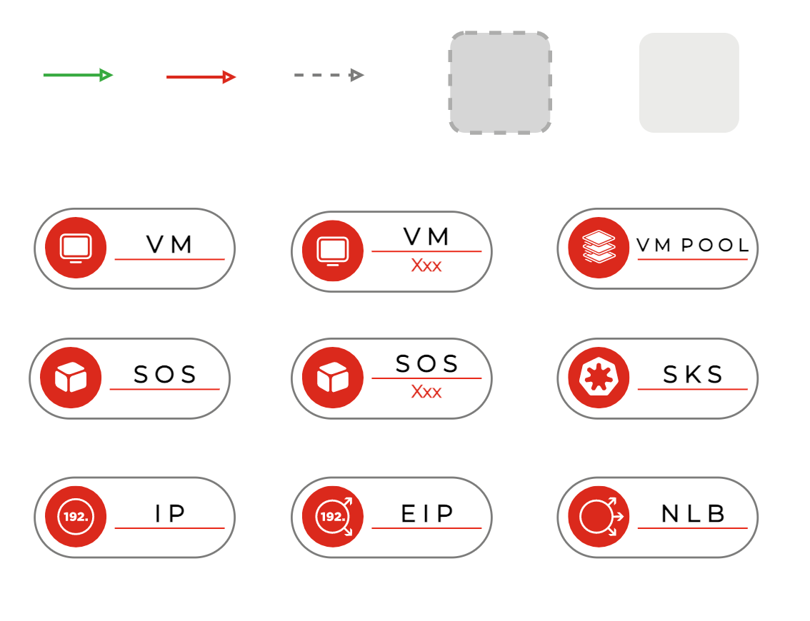
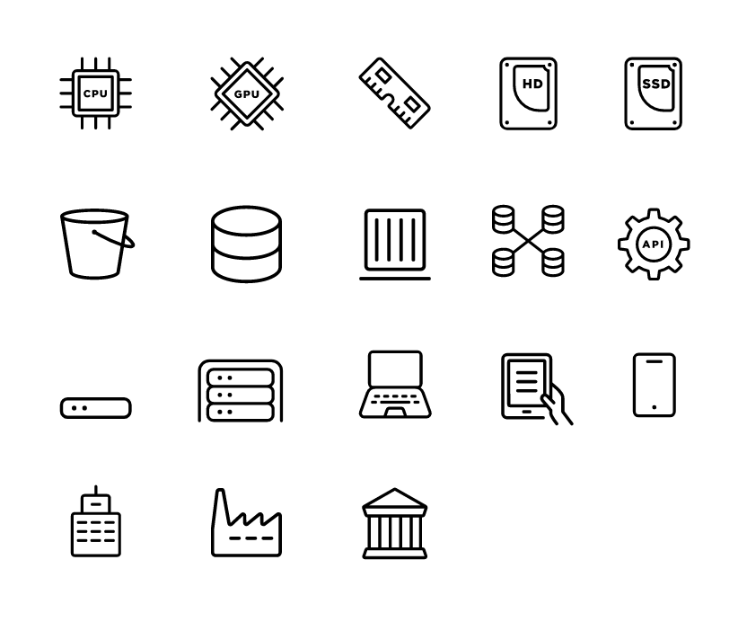
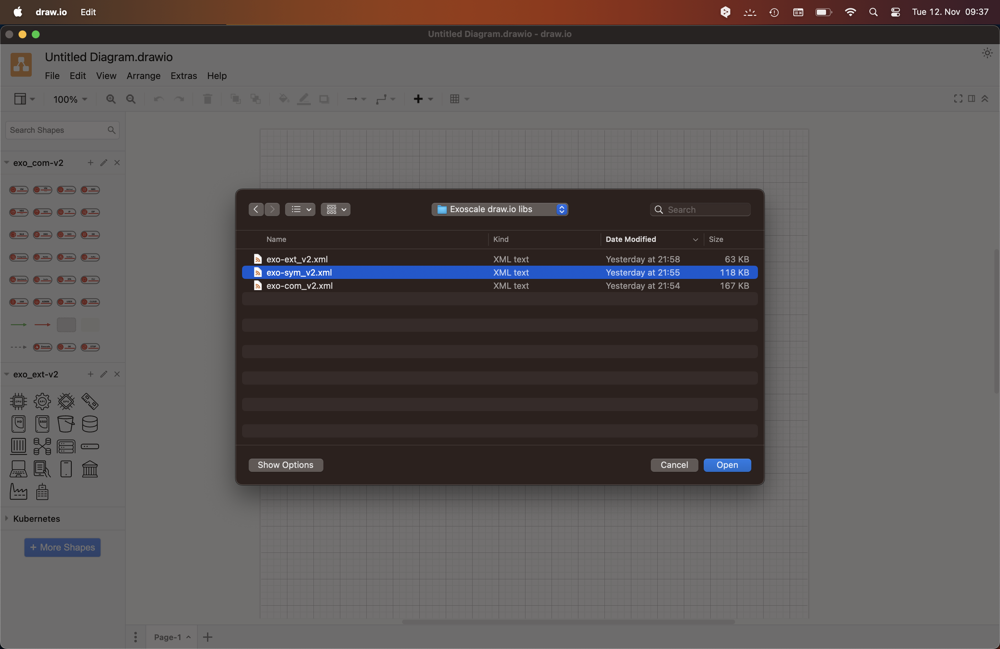
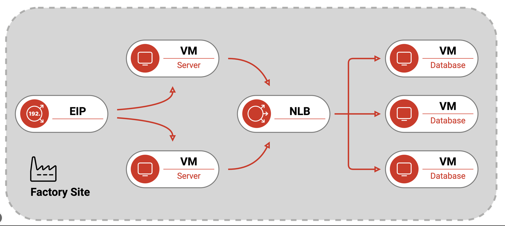
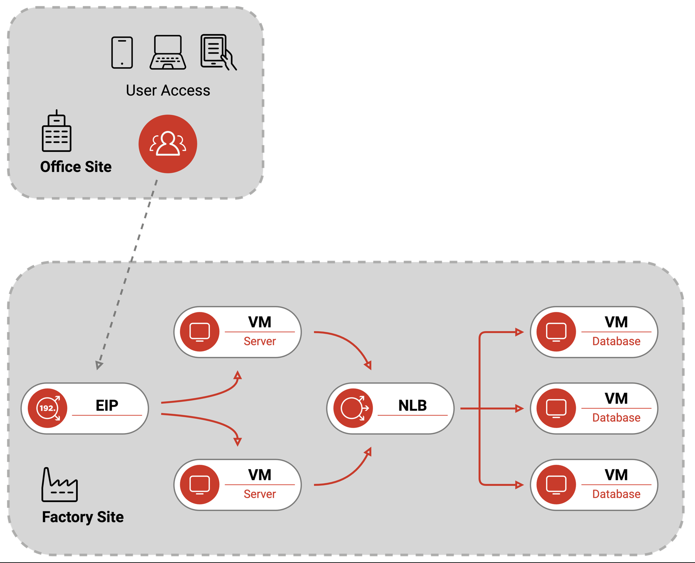

# The Exoscale Icon Libraries

The Exoscale `draw.io` icon libraries provide three sets of icons to visualise and conceptualise various architecture and infrastructure diagrams. This library is for the tool [diagrams.net](https://app.diagrams.net/), previously draw.io, an online diagramming web site.

## exoscale
The file `exoscale.xml` holds the library of the Exoscale icons.

## exoscale_com
The file `exoscale_com.xml` holds the library of the Exoscale Components icons.

## exoscale_ext
The file `exoscale_ext.xml` holds the library of the External icons.

## Installation
To get started, download the archive of icons from [GitHub](https://github.com/exoscale/drawio-library/releases) and use in `draw.io` the `Open Library...` command in the `File` menu.

## Usage
If you have opened all three icon libraries, you can access all icons on the right-hand side of the UI; clicking on one of the icons will place it on your drawing canvas. The initial icon sizing is so structured that usage is proportional aligned.

## Examples

### Example  1

### Example 2

