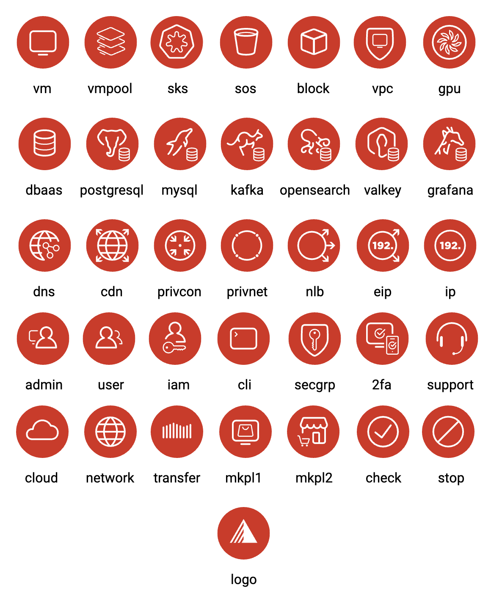
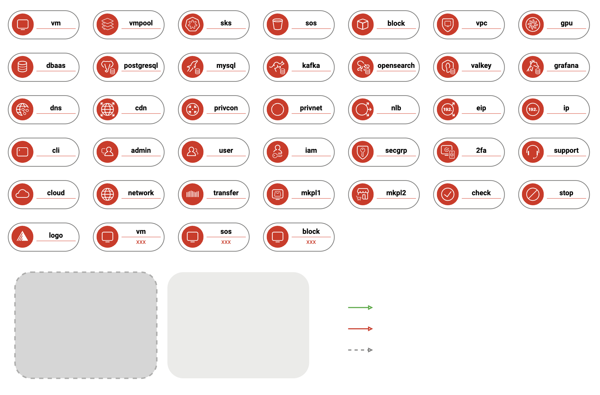
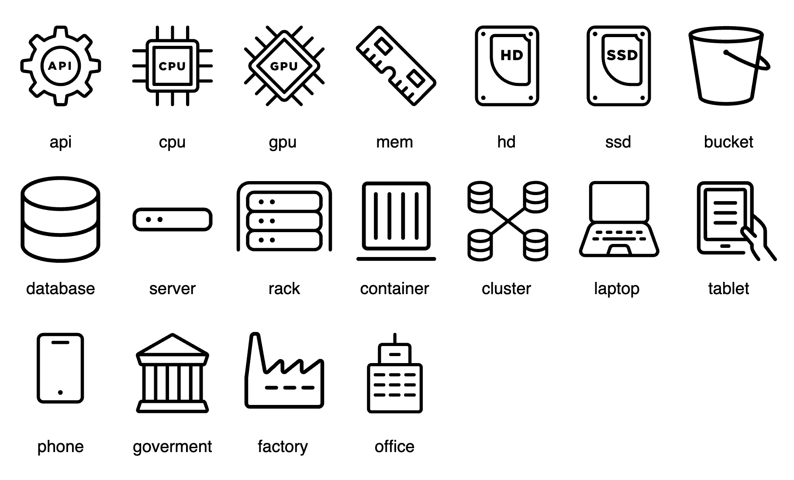
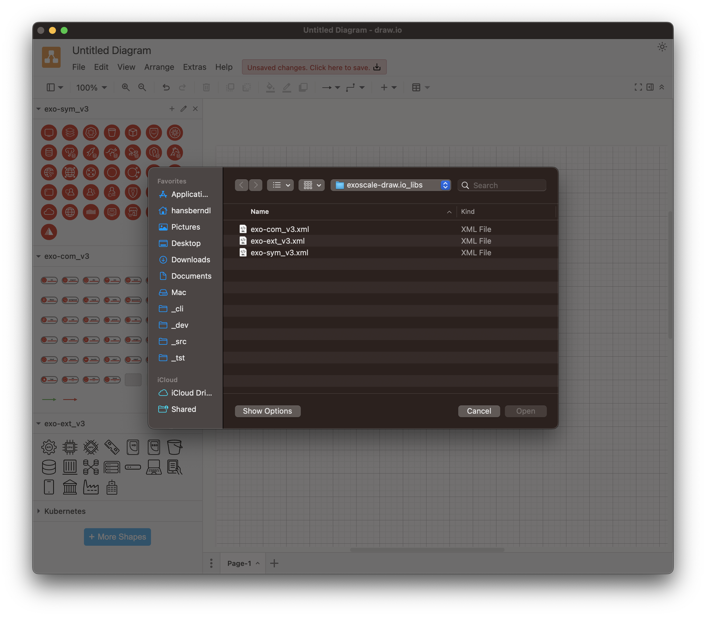
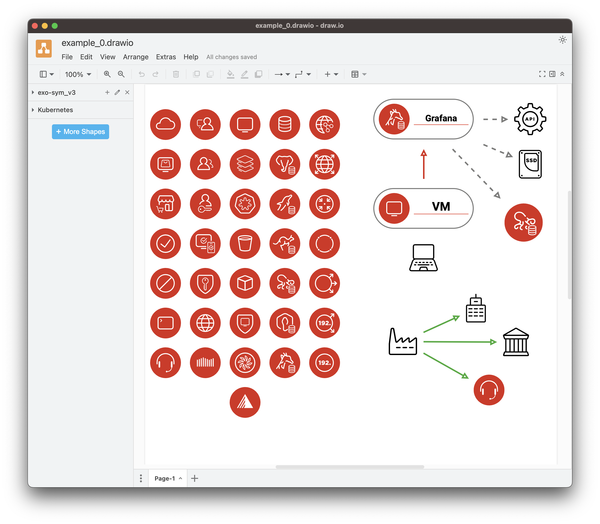
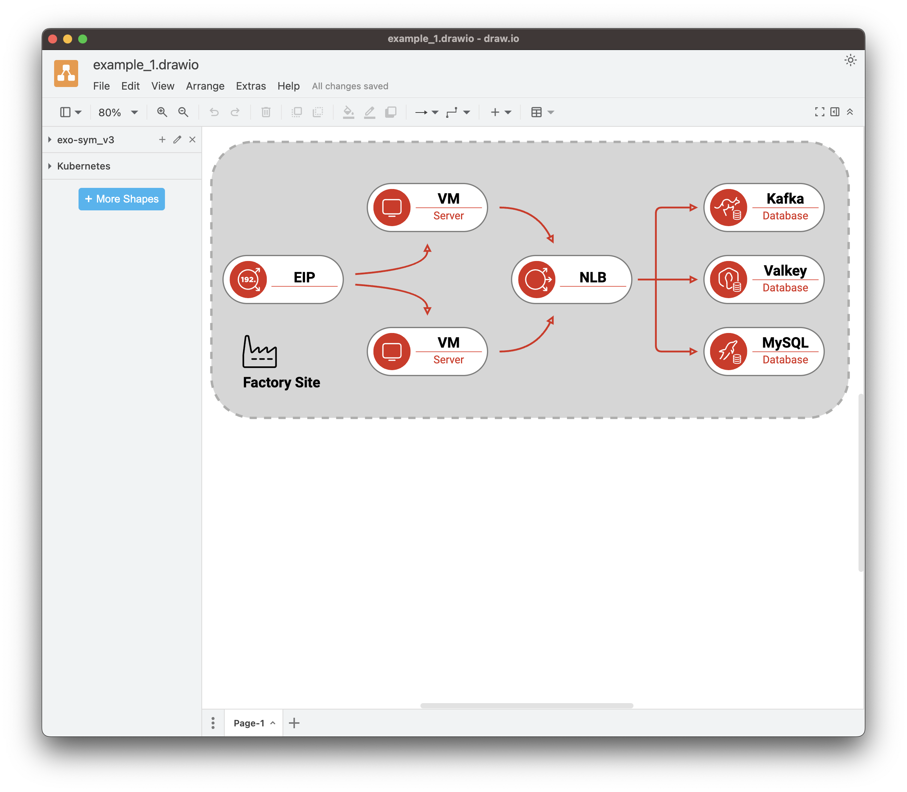

# The Exoscale Icon Libraries

The Exoscale `draw.io` icon libraries provide three sets of icons to visualize and conceptualize various architecture and infrastructure diagrams. These libraries are for the tool [diagrams.net](https://app.diagrams.net/), previously draw.io, an online diagramming website.

## Exoscale Symbol
The file `exo-sym_v3.xml` holds the library of the Exoscale Symbol icons for product and feature.

## Exoscale Component
The file `exo-com_v3.xml` holds the library of the Exoscale Component icons.

## Exoscale External
The file `exo-ext_v3.xml` holds the library of the External generic icons.

## Installation
To get started, download the archive of icons from [GitHub](https://github.com/exoscale/drawio-library/releases) and use the `Open Library...` command in the `File` menu in `draw.io`.

## Usage
If you have opened all three icon libraries, you can access all icons on the right-hand side of the UI; clicking on one of the icons will place it on your drawing canvas. The initial icon sizing is so structured that usage is proportionally aligned.

## Examples

### Example 1

### Example 2

