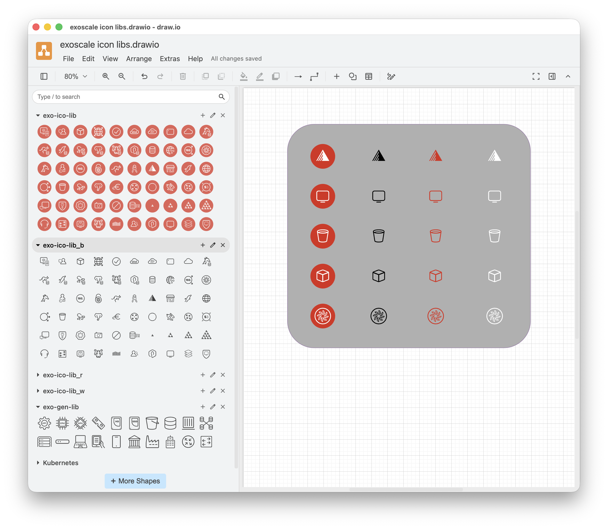

# Exoscale Icon Libraries

The Exoscale `drawio-library` repository offers three categories of icon libraries to help you create clear architecture and infrastructure diagrams with `draw.io`. These libraries work with both the __draw.io Desktop__ app ([Linux, macOS, Windows downloads](https://github.com/jgraph/drawio-desktop/releases)) and the online tool at [app.diagrams.net](https://app.diagrams.net).

> __NOTE__  
  For a detailed guide on using custom libraries, see this [blog post](https://www.drawio.com/blog/custom-libraries).

## Library Categories

1. __Exoscale Product Icons__  
   Official product logos.
2. __Exoscale Icons__  
   Variations of official product logos (black, red, and white line styles).
3. __Exoscale Generic Icons__  
   General-purpose symbols (e.g., server, router, switch) for larger or cross-platform diagrams.

### Exoscale Product Icons
- File: `exo-ico-lib.xml`  
  Contains the official product logos.

### Exoscale Icons
- Files: `exo-ico-lib_<color-code>.xml`  
  Contains icon variations in different color codes:

| `<color-code>` | Color       |
| :------------- | :---------- |
| `_b`           | black-line  |
| `_r`           | red-line    |
| `_w`           | white-line  |

> __NOTE__  
  Find an up-to-date overview of product icon variations in the [Icon-Overview](https://community.exoscale.com/tools/icon-table/).

### Exoscale Generic Icons
- File: `exo-gen-lib.xml`  
  Contains general-purpose icons.

## Installation

1. Download the icon archive from [GitHub](https://github.com/exoscale/drawio-library/releases).
2. In draw.io, use the `Open Library...` command from the `File` menu.

## Usage

Once loaded, the icons and components will appear in the left panel. Click any icon to place it on your canvas. Icons are proportionally sized for consistent diagrams.

## Example

