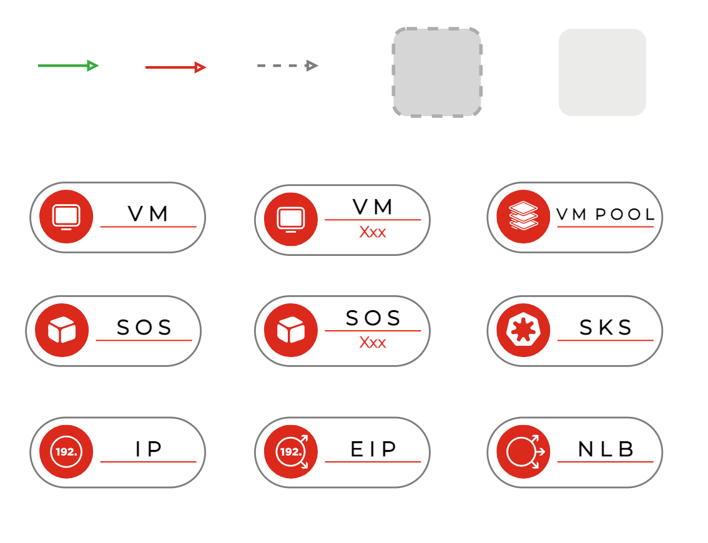
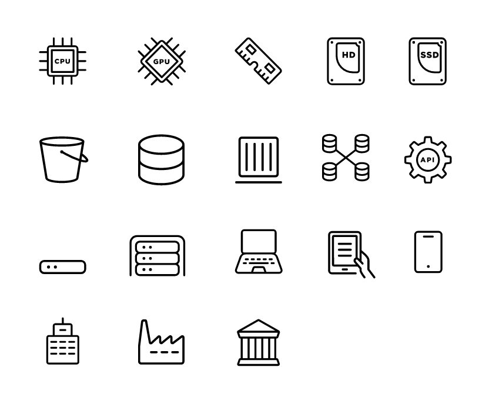
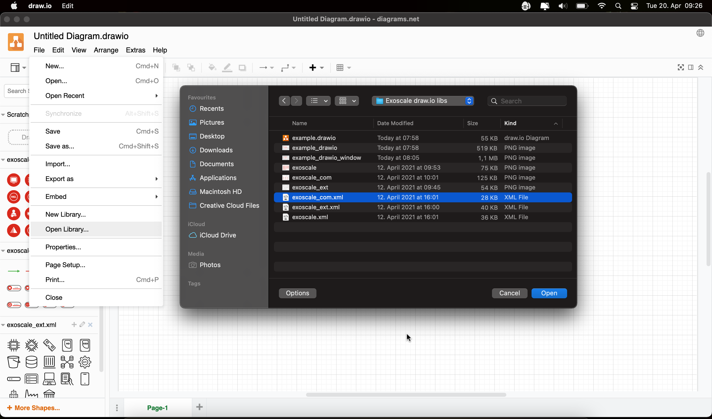
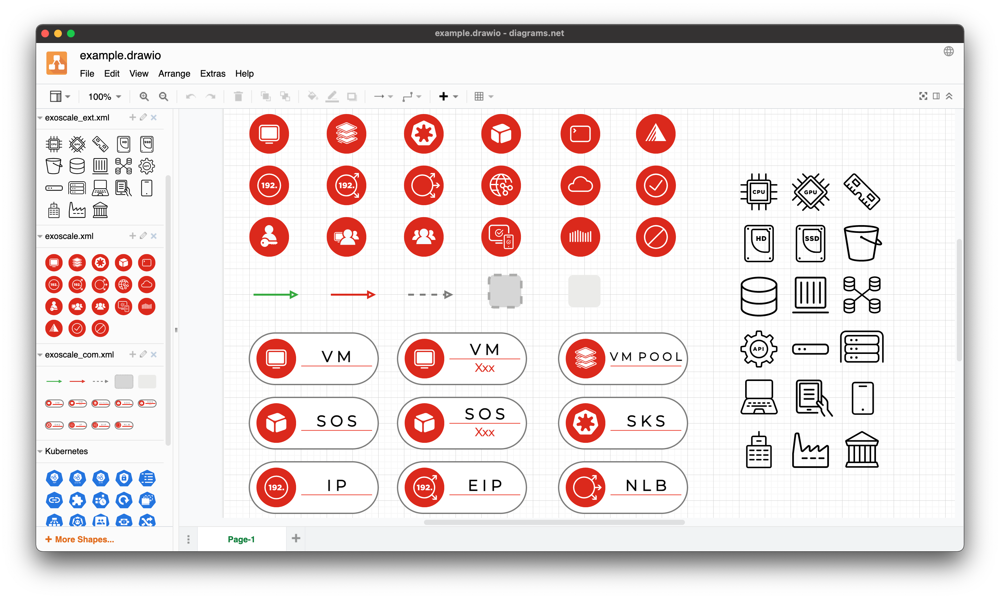
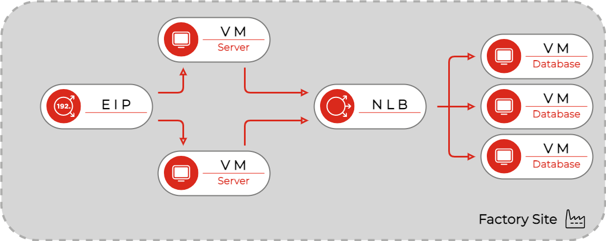
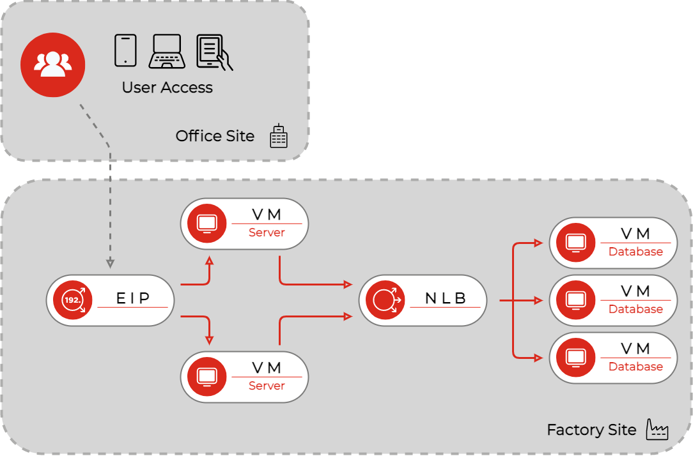

# The Exoscale Icon Libraries v2

The Exoscale `draw.io` icon libraries provide three sets of icons to visualize and conceptualize various architecture and infrastructure diagrams. This library is for the tool [draw.io](https://draw.io/), an online diagramming website. You can also use the desktop app for your respective platform, the latest version of which can be found [here](https://github.com/jgraph/drawio-desktop).

## exoscale
The file `exoscale.xml` holds the library of the Exoscale icons.

## exoscale_com
The file `exoscale_com.xml` holds the library of the Exoscale Components icons.

## exoscale_ext
The file `exoscale_ext.xml` holds the library of the External icons.

## Installation
To get started, download the archive of icons from [GitHub](https://github.com/exoscale/drawio-library/releases) and use the `Open Library...` command in the `File` menu in `draw.io`.

## Usage
If you have opened all three icon libraries, you can access all icons on the right-hand side of the UI; clicking on one of the icons will place it on your drawing canvas. The initial icon sizing is so structured that usage is proportionally aligned.

## Examples

### Example  1

### Example 2

