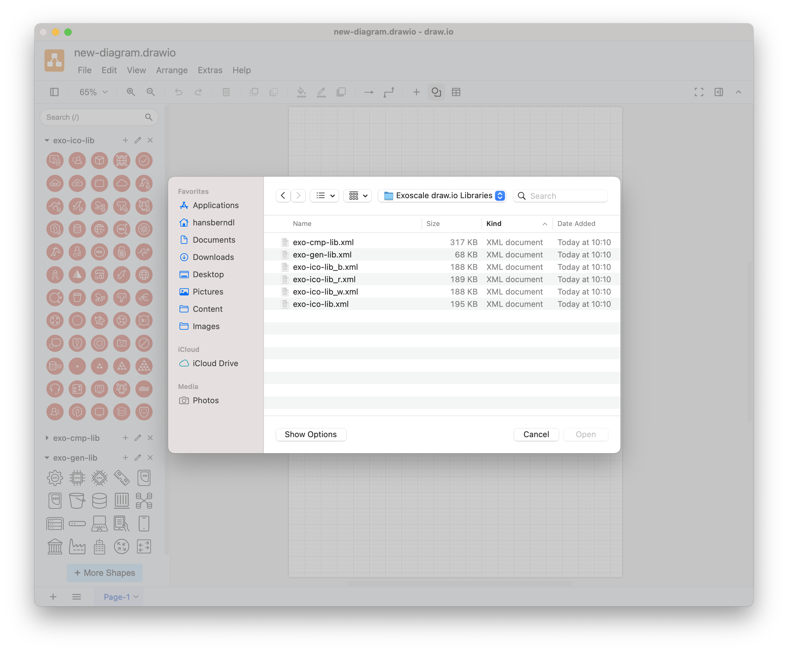
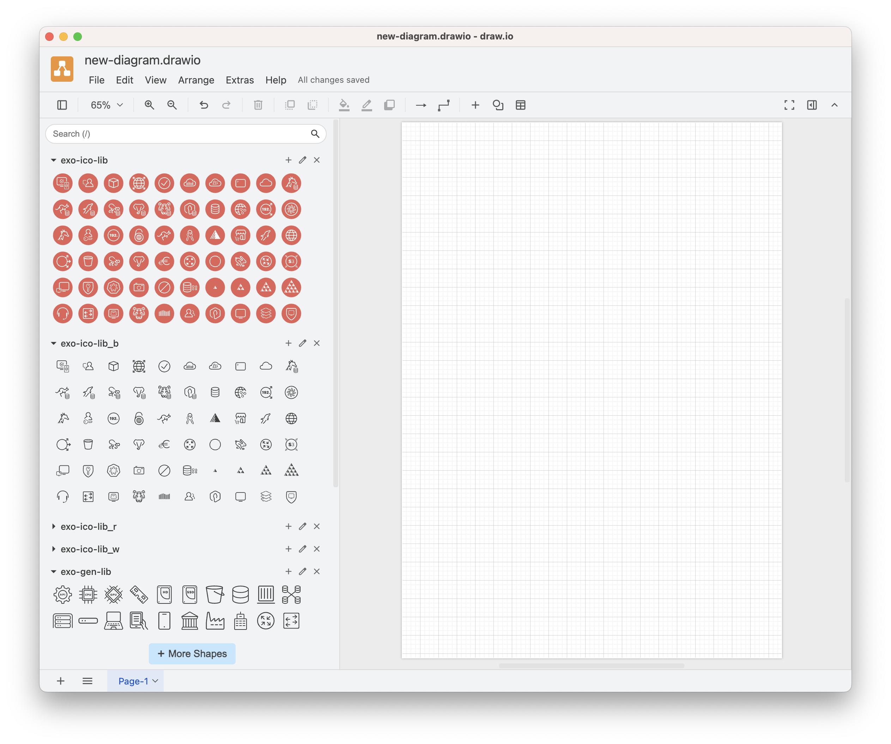
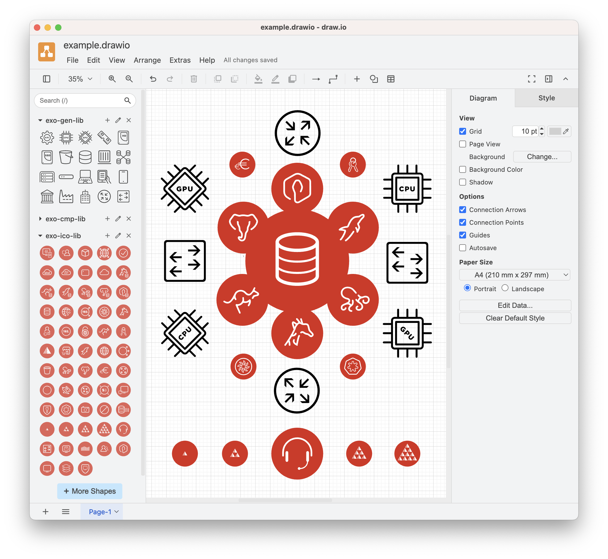

# The Exoscale Icon Libraries

The Exoscale [`drawio-library`](https://github.com/exoscale/drawio-library) repository provides four categories of icon libraries for creating clear architecture and infrastructure diagrams in `draw.io`. These libraries work with `draw.io`, available as the cross-platform __draw.io Desktop__ app ([Linux, macOS, Windows downloads](https://github.com/jgraph/drawio-desktop/releases)) or directly in your browser at [app.diagrams.net](https://app.diagrams.net).

> __NOTE__  
  This [blog post](https://www.drawio.com/blog/custom-libraries) provides a detailed guide on using custom libraries in draw.io.

## Four Library Categories
1. __Exoscale Product__  
   Official product logos.
2. __Exoscale Icon__  
   Icon variations of the official product logos in black, red, and white.
3. __Exoscale Generic__  
   General-purpose symbols—server, router, switch, and more—are ideal for larger or cross-platform diagrams.
4. __Exoscale Component__  
   Reusable diagram elements built from the official product icons.
   
### Exoscale Product
The file `exo-ico-lib.xml` holds the library of the official product logos.

### Exoscale Icon
The file `exo-ico-lib_<color-code>.xml` holds the library of the product icons variation in `<color-code>` color.

__`<color-code>`__:   
 - `_b` ... black 
 
 - `_r` ... red
 
 - `_w` ... white   
 
 
> __NOTE__    
  You can have a look at the most up-to-date version of all the variations [here]().

### Exoscale Generic
The file `exo-gen-lib.xml` holds the library of the generic icons.

### Exoscale Component
The file `exo-cmp-lib.xml` holds the library of the component symbols.

## Library Installation
To get started, download the archive of icons from [GitHub](https://github.com/exoscale/drawio-library/releases) and use the `Open Library...` command in the `File` menu in `draw.io`.

## Library Usage
If you have opened all icon libraries, you can access all icons and components on the left-hand side of the UI; clicking on one of the icons will place it on your drawing canvas. The initial icon sizing is so structured that usage is proportionally aligned.

## Examples
Here, you can see some usage scenarios for the libraries. 

### Example
You can use the icons freely and resize, rotate, and mirror them within draw.io diagrams; your creativity is the only limit.

### Diagram
A general infrastructure diagram using the icons and pre-configured components.

### Block Storage Diagrams
Technical illustrations for presentation and documentation can be easily created with the library components. 

